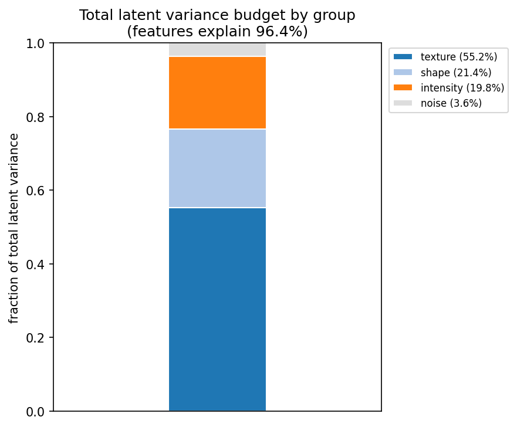
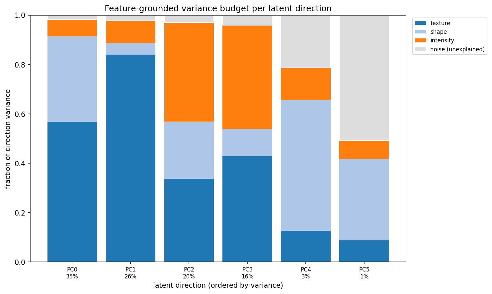

# Naming the Directions of a Latent Space

A small Python package for **feature-grounded variance decomposition**: given the
latent codes from any encoder (a VAE, an autoencoder, CLIP, ...) and a bank of
interpretable features (radiomic descriptors, hand-crafted measurements,
metadata), it answers a simple question for every latent direction —

> *What fraction of this direction's variance do the interpretable features
> explain, and how does that explained variance split across feature groups and
> individual features?*

Whatever the features cannot account for is reported as an explicit
**irreducible-noise** budget, so each direction is summarized by a set of named
shares plus a noise remainder that together sum to one. The result is a latent
space whose axes carry interpretable labels instead of opaque indices.

<table>
<tr>
<td width="50%"></td>
<td width="50%"></td>
</tr>
<tr>
<td><em>The whole latent space in one bar: the variance-weighted share of total
latent variance attributed to each feature group, with the gray segment the
unexplained (noise) remainder. They sum to one, so this is the <code>rho</code>
headline broken out by group.</em></td>
<td><em>The same budget resolved per latent direction. Each bar is one direction
(the percentage below it is the share of total latent variance it carries);
colored segments are the per-group shares and the gray segment is the noise
remainder. High-variance directions are almost entirely explained; the
lowest-variance ones are increasingly noise.</em></td>
</tr>
</table>

## Installation

```bash
pip install fgvb
```

## Quickstart

```python
import fgvb
decomp = fgvb.FeatureGroundedDecomposition(df_latent, df_feat, feat_to_group)
scree_fig = decomp.scree()
global_table, rho, global_fig = decomp.global_budget()
shap_table, rho, shap_fig = decomp.shap()
johnson_table, rho, johnson_fig = decomp.johnson()
```

See **[`notebooks/tutorial.ipynb`](notebooks/tutorial.ipynb)** for a walkthrough of the whole workflow on a small synthetic dataset and the API details.

## Output

For each latent direction the method produces an additive variance budget:

- a **group-level (SHAP) budget** — collinearity-aware Shapley shares of the
  explained variance per feature family (shape, texture, intensity, ...), plus
  the noise remainder;
- a **per-feature (Johnson) budget** — the same explained variance refined down
  to individual features;
- a single **global budget** that collapses all directions into one stacked bar,
  weighted by how much variance each direction carries.

A cross-validated $R^2$ keeps the explained fraction from being inflated by
overfitting, and the group shares, per-feature shares, and noise all partition
each direction's variance exactly.

## Reference

This package accompanies the paper *Naming the Directions of a Latent Space:
Feature-Grounded Variance Decomposition with an Irreducible-Noise Budget* by Joseph Rich, Raphi Kang, Pietro Perona, and Lior Pachter
([DOI: forthcoming](https://doi.org/)).